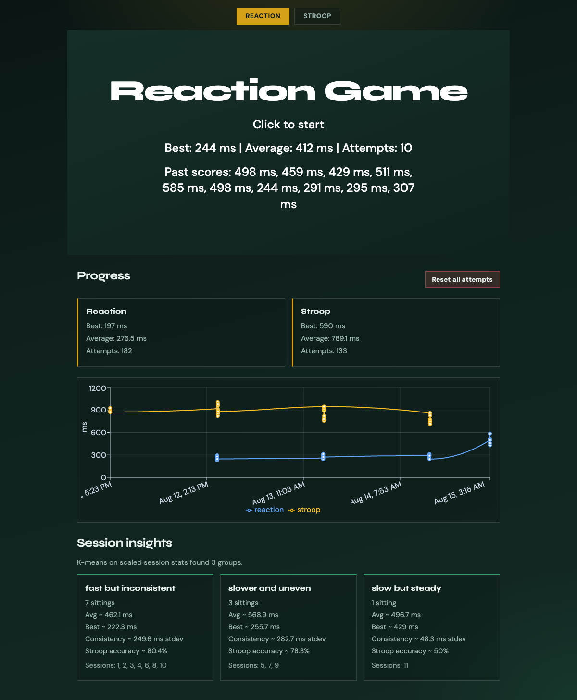
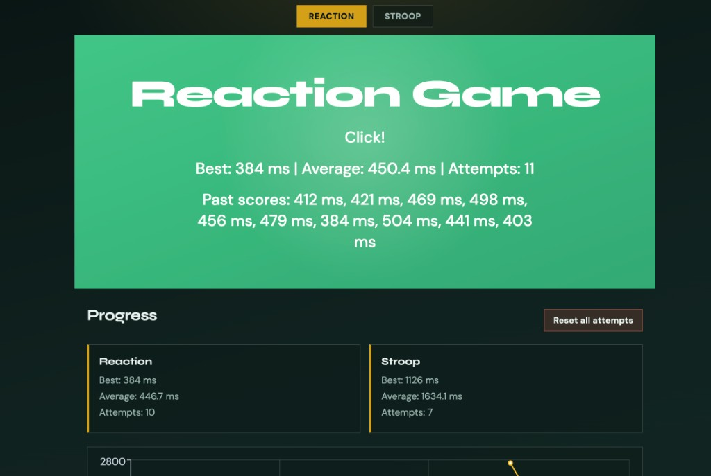
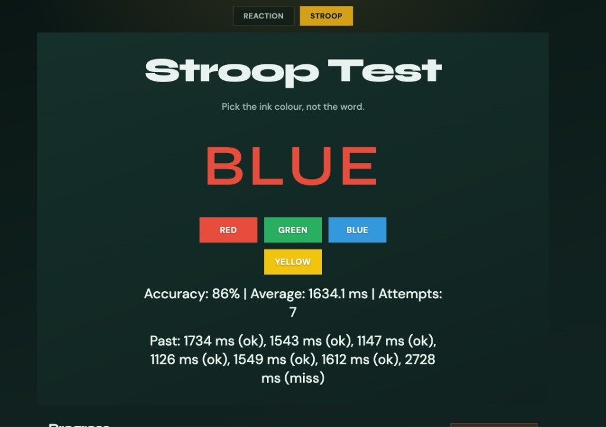
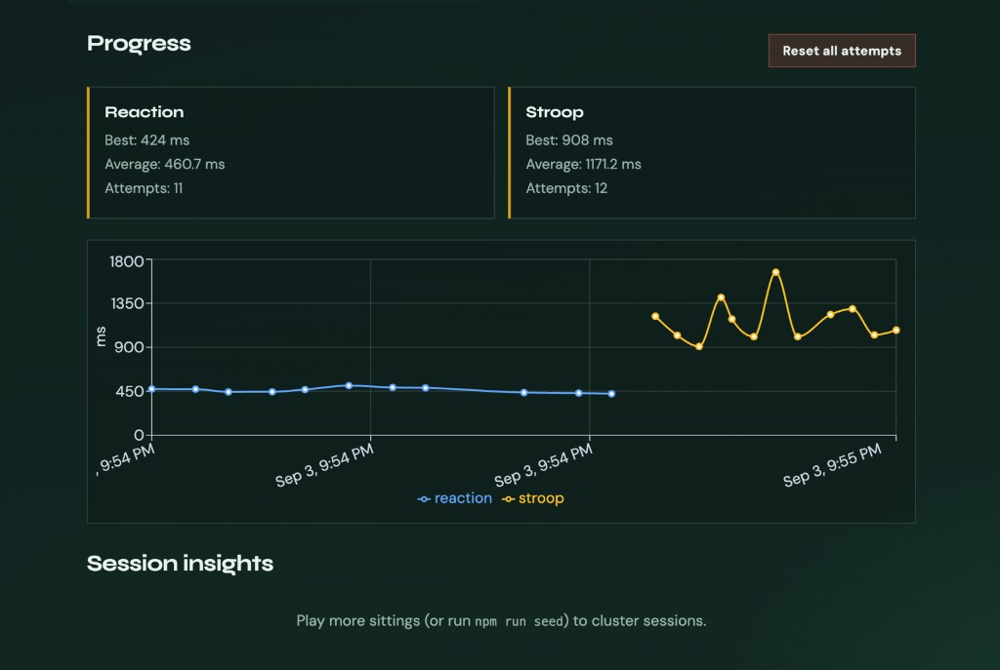

# Reaction & Stroop Lab

A small practice lab for reaction time and Stroop colour interference. Play a round, save the result, then look at progress over real calendar time and how your sittings cluster together.



## Screenshots

### Reaction Game
The reaction game measures response time while tracking previous attempts, best time, and average performance.



### Stroop Test
The Stroop test challenges users to identify the ink color rather than the displayed word while tracking both response time and accuracy.



### Progress Tracking
Reaction and Stroop results are stored and visualized over time, allowing users to compare performance across attempts.



## Tech stack

- **Frontend:** React + Vite, Recharts
- **Backend:** FastAPI + Uvicorn
- **Database:** SQLite (`backend/scores.db`)
- **ML:** scikit-learn (`StandardScaler` + `KMeans`)
- **Tests:** pytest

## Features

- Reaction game: wait for green, click as fast as you can
- Stroop test: pick the ink colour, not the word
- Scores stored with a timestamp and game label (`reaction` / `stroop`)
- Progress chart plotted against real timestamps (not attempt number)
- Stats: best, average, and attempt count per game
- Session grouping: idle gap over 30 minutes starts a new sitting
- Session insights: k-means clusters with readable labels
- Reset button calls `DELETE /scores` and clears **both** games on the server (sessions and insights span both games, so a screen-only clear would leave stale data)
- Offline banner when the API is unreachable
- Sample multi-session data via `npm run seed`

## What the ML found

On the seeded sample data, StandardScaler + k-means usually finds a large **“fast but inconsistent”** cluster (quick averages with high spread), a smaller **“slower and uneven”** group, and occasionally a **“slow but steady”** sitting with fewer attempts and tighter consistency.

## How to run

You need two terminals, both from the project root.

### 1. Install dependencies (first time)

```bash
# Frontend
npm install

# Backend
python3 -m venv .venv
.venv/bin/pip install -r backend/requirements.txt
```

### 2. Start the backend

```bash
npm run api
```

API docs: http://localhost:8000/docs

### 3. Start the frontend

```bash
npm run dev
```

App: http://localhost:5173/

### 4. Optional: seed sample session data

```bash
npm run seed
```

This resets the database and inserts ~300 scores across ~10 sittings so session clustering has enough data to show groups.

## Tests

```bash
cd backend
../.venv/bin/pytest -q
```

## API overview

| Method | Path | Purpose |
|--------|------|---------|
| GET | `/health` | Health check |
| POST | `/scores` | Save a score |
| GET | `/scores` | List recent scores (`?game=reaction\|stroop`) |
| GET | `/stats` | Best / average / attempts per game |
| GET | `/sessions` | Group scores into sessions and summarize each |
| GET | `/insights` | K-means clusters of sessions with readable labels |
| DELETE | `/scores` | Clear all scores (both games) |
